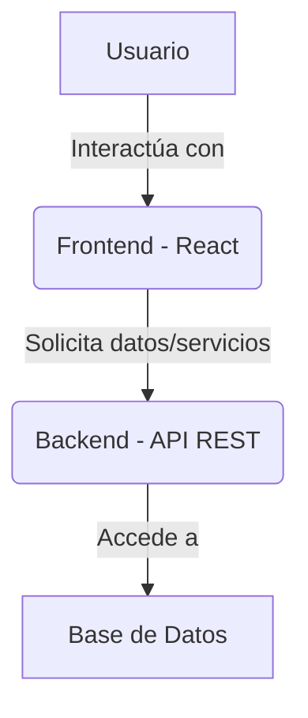

# CodeViz Research Context

> **Note**: This file contains research context from CodeViz. Most recent contexts are at the bottom.

---

## Research Query

crea un diagrama de mi proyecto incluyendo back y front

*Session: 2316da3b0d3bc8962d6dce81c2434472 | Generated: 7/3/2025, 11:51:27 AM*

### Analysis Summary

# Diagrama de Arquitectura del Proyecto "Proyecto-Final-Fidanza"

Este documento describe la arquitectura del proyecto "Proyecto-Final-Fidanza", que se compone de un frontend desarrollado con React y un backend (cuya implementación no está directamente visible en la estructura de directorios proporcionada, pero se infiere su existencia por la naturaleza de una aplicación web completa).

## 1. Arquitectura General

El proyecto sigue una arquitectura cliente-servidor. El frontend, construido con React, se encarga de la interfaz de usuario y la interacción con el usuario, mientras que el backend (no visible en la estructura proporcionada) manejaría la lógica de negocio, la persistencia de datos y la autenticación.



## 2. Frontend (React Application)

El frontend es una aplicación React que reside en el directorio `src`. Está organizada en componentes reutilizables, contextos para la gestión del estado global y archivos de estilo.

### 2.1. Componentes Principales

Los componentes principales se encuentran en `src/components` y se encargan de diferentes secciones y funcionalidades de la aplicación:

*   **Navegación y Diseño General:**
    *   [NavBar](file:src/components/NavBar/NavBar.jsx): Componente de la barra de navegación superior, incluyendo el carrito de compras.
    *   [Footer](file:src/components/Footer/Footer.jsx): Componente del pie de página.
    *   [Hero](file:src/components/Hero/Hero.jsx): Componente de la sección principal o "hero" de la página de inicio.

*   **Gestión de Productos y Listados:**
    *   [ItemListContainer](file:src/components/ItemListContainer/ItemListContainer.jsx): Contenedor principal para mostrar listas de productos.
    *   [Item](file:src/components/Item/Item.jsx): Componente individual para mostrar un producto en la lista.
    *   [ItemDetail](file:src/components/ItemDetail/ItemDetail.jsx): Componente para mostrar los detalles de un producto específico.
    *   [Categorias](file:src/components/Categorias/Categorias.jsx): Componente para la navegación por categorías de productos.
    *   [OfertasDestacadas](file:src/components/OfertasDestacadas/OfertasDestacadas.jsx): Componente para mostrar ofertas destacadas.
    *   [Gaming](file:src/components/Gaming/Gaming.jsx): Componente para la sección de productos de gaming.
    *   [Consolas](file:src/components/Consolas/Consolas.jsx): Componente para la sección de consolas.
    *   [Audio](file:src/components/Audio/Audio.jsx): Componente para la sección de productos de audio.

*   **Carrito de Compras y Checkout:**
    *   [CartWidget](file:src/components/CartWidget/CartWidget.jsx): Widget del carrito de compras en la barra de navegación.
    *   [Cart](file:src/components/Cart/Cart.jsx): Vista principal del carrito de compras.
    *   [CartSidebar](file:src/components/CartSidebar/CartSidebar.jsx): Posiblemente un sidebar para el carrito de compras.
    *   [CheckoutForm](file:src/components/CheckoutForm/CheckoutForm.jsx): Formulario para el proceso de checkout.
    *   [Factura](file:src/components/Factura/Factura.jsx): Componente para mostrar la factura o resumen de la compra.

*   **Autenticación y Usuarios:**
    *   [Login](file:src/components/Login/Login.jsx): Componente para el inicio de sesión de usuarios.
    *   [ProtectedRoute](file:src/components/ProtectedRoute/ProtectedRoute.jsx): Componente para proteger rutas que requieren autenticación.

*   **Otros:**
    *   [About](file:src/components/About/About.jsx): Componente para la sección "Acerca de".
    *   [ContactForm](file:src/components/ContactForm/ContactForm.jsx): Formulario de contacto.

### 2.2. Gestión del Estado

El estado global de la aplicación se gestiona a través de React Context, definido en [AppContext.jsx](file:src/context/AppContext.jsx). Esto permite que diferentes componentes compartan y actualicen datos sin la necesidad de pasar props manualmente a través de múltiples niveles.

### 2.3. Archivos Principales del Frontend

*   [main.jsx](file:src/main.jsx): Punto de entrada de la aplicación React, donde se renderiza el componente principal `App`.
*   [App.jsx](file:src/App.jsx): Componente raíz de la aplicación, donde se definen las rutas y se orquestan los componentes principales.
*   [Products.jsx](file:src/Products.jsx): Posiblemente un archivo que contiene la definición o la lógica para los datos de los productos.

## 3. Backend (Inferencia)

Aunque no se proporcionan archivos de backend en la estructura, una aplicación de comercio electrónico como esta requeriría un backend para:

*   **API REST:** Proporcionar endpoints para la gestión de productos (obtener, añadir, actualizar, eliminar), usuarios, carritos de compra, pedidos, etc.
*   **Base de Datos:** Almacenar información sobre productos, usuarios, pedidos, etc.
*   **Autenticación y Autorización:** Gestionar el registro de usuarios, inicio de sesión y permisos.
*   **Lógica de Negocio:** Procesar pedidos, calcular precios, gestionar inventario, etc.

### 3.1. Interacción Frontend-Backend

El frontend se comunicaría con el backend a través de llamadas a la API REST (por ejemplo, usando `fetch` o librerías como Axios) para obtener datos de productos, enviar información del carrito, procesar pagos, etc.

```mermaid
graph TD
    subgraph Frontend
        A[App.jsx] --> B(Componentes de UI)
        B --> C(AppContext.jsx)
        C --> D{Llamadas a la API}
    end

    subgraph Backend (Inferencia)
        E[API REST Endpoints] --> F[Lógica de Negocio]
        F --> G[Base de Datos]
    end

    D -->|HTTP/HTTPS| E
```

### Implementation Steps

1. **Understanding the Overall Architecture**
   The project follows a client-server architecture. The frontend, built with React, handles the user interface, while the backend manages business logic, data persistence, and authentication. The user interacts with the `Frontend`, which then requests data and services from the `Backend API REST`, which in turn accesses a `Database`.

2. **Exploring the Frontend (React Application)**
   The frontend is a React application primarily located in the `src` directory. It is organized into reusable components, contexts for global state management, and styling files. It serves as the user-facing part of the application.

3. **Key Frontend Components**
   The frontend includes various components categorized by their function. These include components for `Navigation and General Design` (like `NavBar`, `Footer`, `Hero`), `Product Management and Listings` (such as `ItemListContainer`, `Item`, `ItemDetail`, `Categorias`), `Shopping Cart and Checkout` (like `CartWidget`, `Cart`, `CheckoutForm`), and `Authentication and Users` (including `Login`, `ProtectedRoute`). There are also general components like `About` and `ContactForm`.

4. **Frontend State Management**
   Global state management in the frontend is handled using React Context, defined in `AppContext`. This allows different components to share and update data efficiently without prop drilling.

5. **Core Frontend Files**
   The main entry point for the React application is `main.jsx`, which renders the primary `App` component. The `App.jsx` component serves as the root, defining routes and orchestrating the main components. Additionally, `Products.jsx` likely contains product data or related logic.

6. **Understanding the Backend (Inferred)**
   Although not explicitly provided in the directory structure, a complete e-commerce application requires a backend. This inferred `Backend` would provide `REST API` endpoints for managing products, users, carts, and orders. It would also handle `Database` interactions, `Authentication and Authorization`, and core `Business Logic` such as order processing and inventory management.

7. **Frontend-Backend Interaction**
   The `Frontend` communicates with the `Backend` via `HTTP/HTTPS` calls to the `REST API Endpoints`. Components within the `Frontend` (like `App.jsx` and other `UI Components`) use `AppContext` to manage state, which then facilitates these API calls. The `Backend` processes these requests through its `Business Logic` and interacts with the `Database`.

